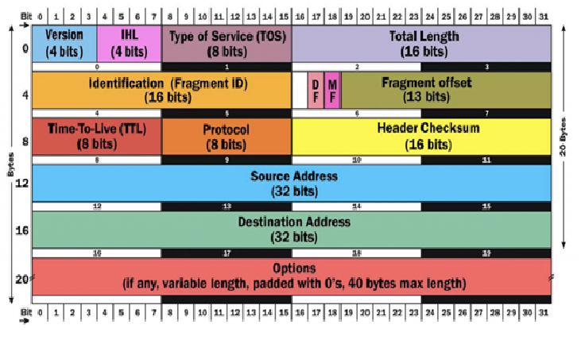

Let’s start with a basic command that will get us HTTPS traffic:

```ps
tcpdump -nnSX port 443
```

You can get a single packet with -c 1, or n number with -c n

## everything on an interface

Just see what’s going on, by looking at what’s hitting your interface.

```ps
tcpdump -i eth0
```

Or get all interfaces with `-i any`

## find traffic by ip

One of the most common queries, using host, you can see traffic that’s going to or from 1.1.1.1.

```ps
tcpdump host 1.1.1.1
```

- Expression Types: _host_, _net_, and _port_.
- Directions: _src_ and _dst_.
- Protocols: _tcp_, _udp_, _icmp_, and many more.

## filtering by source and/or destination

If you only want to see traffic in one direction or the other, you can use src and dst.

```ps
tcpdump src 1.1.1.1

tcpdump dst 1.0.0.1
```

## finding packets by network

To find packets going to or from a particular network or subnet, use the net option.

```ps
tcpdump net 1.2.3.0/24
```

## get packet contents with hex output

Hex output is useful when you want to see the content of the packets in question, and it’s often best used when you’re isolating a few candidates for closer scrutiny.

```ps
tcpdump -c 1 -X icmp
```

## show traffic related to a specific port

You can find specific port traffic by using the port option followed by the port number.

```ps
tcpdump port 3389

tcpdump src port 1025
```

## show traffic of one protocol

If you’re looking for one particular kind of traffic, you can use tcp, udp, icmp, and many others as well.

```ps
tcpdump icmp

tcpdump ip6
```

## find traffic using port ranges

You can also use a range of ports to find traffic.

```ps
tcpdump portrange 21-23
```

## find traffic based on packet size

If you’re looking for packets of a particular size you can use these options. You can use less, greater, or their associated symbols that you would expect from mathematics.

```ps
tcpdump less 32

tcpdump greater 64

tcpdump <= 128
```

## reading / writing captures to a file (pcap)

It’s often useful to save packet captures into a file for analysis in the future. These files are known as PCAP (PEE-cap) files, and they can be processed by hundreds of different applications, including network analyzers, intrusion detection systems, and of course by tcpdump itself. Here we’re writing to a file called capture_file using the -w switch.

```ps
tcpdump port 80 -w capture_file
```

You can read PCAP files by using the -r switch. Note that you can use all the regular commands within tcpdump while reading in a file; you’re only limited by the fact that you can’t capture and process what doesn’t exist in the file already.

```ps
tcpdump -r capture_file
```

## More options

Here are some additional ways to tweak how you call tcpdump.

-X : Show the packet’s contents in both hex and ascii.
-XX : Same as -X, but also shows the ethernet header.
-D : Show the list of available interfaces
-l : Line-readable output (for viewing as you save, or sending to other commands)
-q : Be less verbose (more quiet) with your output.
-t : Give human-readable timestamp output.
-tttt : Give maximally human-readable timestamp output.
-i eth0 : Listen on the eth0 interface.
-vv : Verbose output (more v’s gives more output).
-c : Only get x number of packets and then stop.
-s : Define the snaplength (size) of the capture in bytes. Use -s0 to get everything, unless you are intentionally capturing less.
-S : Print absolute sequence numbers.
-e : Get the ethernet header as well.
-q : Show less protocol information.
-E : Decrypt IPSEC traffic by providing an encryption key.

## It’s All About the Combinations
Being able to do these various things individually is powerful, but the real magic of tcpdump comes from the ability to combine options in creative ways in order to isolate exactly what you’re looking for. There are three ways to do combinations, and if you’ve studied programming at all they’ll be pretty familiar to you.

- AND: _and_ or _&&_
- OR: _or_ or _||_
- EXCEPT: _not_ or _!_

## raw output view

Use this combination to see verbose output, with no resolution of hostnames or port numbers, using absolute sequence numbers, and showing human-readable timestamps.

```ps
tcpdump -ttnnvvS

```

## Advanced

### from specific ip and destined for a specific port

Let’s find all traffic from 10.5.2.3 going to any host on port 3389.

```ps
tcpdump -nnvvS src 10.5.2.3 and dst port 3389
```

### from one network to another

Let’s look for all traffic coming from 192.168.x.x and going to the 10.x or 172.16.x.x networks, and we’re showing hex output with no hostname resolution and one level of extra verbosity.

```ps
tcpdump -nvX src net 192.168.0.0/16 and dst net 10.0.0.0/8 or 172.16.0.0/16
```

### non icmp traffic going to a specific ip

This will show us all traffic going to 192.168.0.2 that is not ICMP.

```ps
tcpdump dst 192.168.0.2 and src net and not icmp
```

### traffic from a host that isn’t on a specific port

This will show us all traffic from a host that isn’t SSH traffic (assuming default port usage).

```ps
tcpdump -vv src mars and not dst port 22
```

You can build queries to find just about anything you need. The key is to first figure out precisely what you’re looking for and then to build the syntax to isolate that specific type of traffic.

Keep in mind that when you’re building complex queries you might have to group your options using single quotes. Single quotes are used in order to tell tcpdump to ignore certain special characters—in this case below the “( )” brackets. This same technique can be used to group using other expressions such as host, port, net, etc.

```ps
tcpdump 'src 10.0.2.4 and (dst port 3389 or 22)'
```

### isolate tcp flags

You can also use filters to isolate packets with specific TCP flags set.

#### Isolate TCP RST flags.

```ps
tcpdump 'tcp[13] & 4!=0'
tcpdump 'tcp[tcpflags] == tcp-rst'
```

#### Isolate TCP SYN flags.

```ps
tcpdump 'tcp[13] & 2!=0'
tcpdump 'tcp[tcpflags] == tcp-syn'
```

#### Isolate packets that have both the SYN and ACK flags set.

```ps
tcpdump 'tcp[13]=18'
```

#### Isolate TCP URG flags.

```ps
tcpdump 'tcp[13] & 32!=0'
tcpdump 'tcp[tcpflags] == tcp-urg'
```

#### Isolate TCP ACK flags.

```ps
tcpdump 'tcp[13] & 16!=0'
tcpdump 'tcp[tcpflags] == tcp-ack'
```

#### Isolate TCP PSH flags.

```ps
tcpdump 'tcp[13] & 8!=0'
tcpdump 'tcp[tcpflags] == tcp-push'
```

#### Isolate TCP FIN flags.

```ps
tcpdump 'tcp[13] & 1!=0'
tcpdump 'tcp[tcpflags] == tcp-fin'
```

### everyday recipe examples

Because tcpdump can output content in ASCII, you can use it to search for cleartext content using other command-line tools like grep.
Finally, now that we the theory out of the way, here are a number of quick recipes you can use for catching various kinds of traffic.

#### both syn and rst set

```ps
tcpdump 'tcp[13] = 6'
```

#### find http user agents
The -l switch lets you see the traffic as you’re capturing it, and helps when sending to commands like grep.

```ps
tcpdump -vvAls0 | grep 'User-Agent:'
```

#### cleartext get requests

```ps
tcpdump -vvAls0 | grep 'GET'
```

#### find http host headers

```ps
tcpdump -vvAls0 | grep 'Host:'
```

#### find http cookies

```ps
tcpdump -vvAls0 | grep 'Set-Cookie|Host:|Cookie:'
```

#### find ssh connections
This one works regardless of what port the connection comes in on, because it’s getting the banner response.

```ps
tcpdump 'tcp[(tcp[12]>>2):4] = 0x5353482D'
```

#### find dns traffic

```ps
tcpdump -vvAs0 port 53
```

#### find ftp traffic

```ps
tcpdump -vvAs0 port ftp or ftp-data
```

#### find ntp traffic

```ps
tcpdump -vvAs0 port 123
```

#### find cleartext passwords

```ps
tcpdump port http or port ftp or port smtp or port imap or port pop3 or port telnet -lA | egrep -i -B5 'pass=|pwd=|log=|login=|user=|username=|pw=|passw=|passwd= |password=|pass:|user:|username:|password:|login:|pass |user '
```

#### find traffic with evil bit
There’s a bit in the IP header that never gets set by legitimate applications, which we call the “Evil Bit”. Here’s a fun filter to find packets where it’s been toggled.

```ps
tcpdump 'ip[6] & 128 != 0'
```
